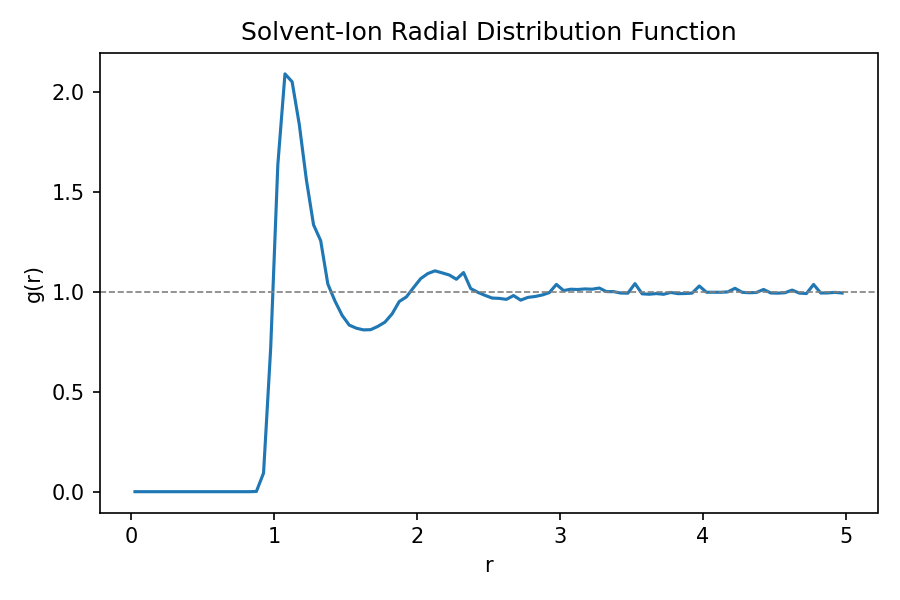
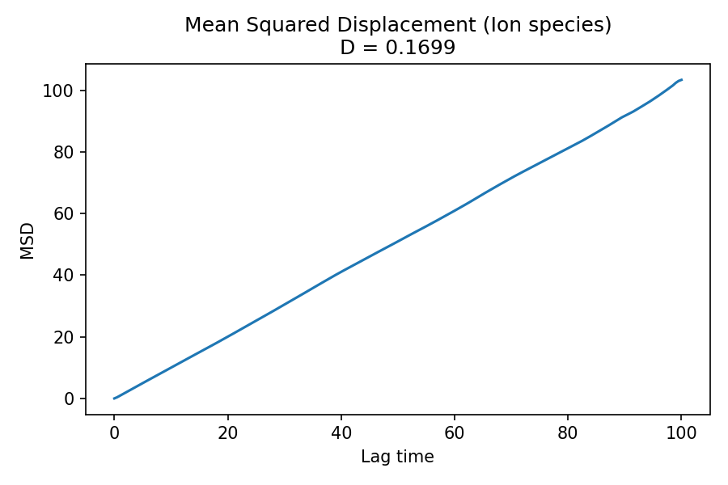

# Electrolyte MD Analysis Toolkit

A Python toolkit for analyzing molecular dynamics trajectories of electrolyte
systems, built on MDAnalysis and LAMMPS. Computes standard structural and
dynamical properties used in battery electrolyte research: radial distribution
functions (RDF), coordination numbers, and diffusion coefficients.

## Status

Core analysis pipeline implemented and validated against a demo molecular
dynamics simulation (see `examples/demo_electrolyte/`): a binary Lennard-Jones
mixture representing a minority "ion" species in a majority "solvent."

## Results (demo system)

**Solvent-ion radial distribution function:**



**Ion mean squared displacement:**




|
 Property 
|
 Value 
|
|
---
|
---
|
|
 RDF peak 
|
 r ≈ 1.1 
|
|
 First solvation shell cutoff 
|
 r = 1.625 
|
|
 Coordination number 
|
 0.965 
|
|
 Diffusion coefficient 
|
 D = 0.170 (reduced LJ units) 
|

Full walkthrough with code: [`examples/demo_electrolyte/analysis_demo.ipynb`](examples/demo_electrolyte/analysis_demo.ipynb)

## Setup

```bash
conda env create -f environment.yml
conda activate electrolyte-portfolio
```

## Usage

```python
import MDAnalysis as mda
from electrolyte_toolkit.rdf import compute_rdf
from electrolyte_toolkit.coordination import coordination_number, first_minimum
from electrolyte_toolkit.diffusion import compute_msd, diffusion_coefficient

u = mda.Universe("trajectory.lammpstrj", format="LAMMPSDUMP")

# Radial distribution function
bins, rdf = compute_rdf(u, "type 1", "type 2", nbins=100, range=(0.0, 5.0))

# Coordination number within the first solvation shell
r_cut = first_minimum(bins, rdf)
cn = coordination_number(bins, rdf, number_density, r_max=r_cut)

# Diffusion coefficient (requires an unwrapped-coordinate trajectory)
msd = compute_msd(u, select="type 2")
D = diffusion_coefficient(msd, timestep=frame_dt, dim=3)
```

## Project Structure

- `src/electrolyte_toolkit/` — analysis toolkit source code (`rdf.py`, `coordination.py`, `diffusion.py`)
- `examples/demo_electrolyte/` — demo LAMMPS simulation input, trajectory analysis notebook, and output plots
- `tests/` — unit tests (in progress)

## Roadmap

- Unit tests validating each module against known synthetic data
- Extend to realistic electrolyte force fields (e.g., TIP3P water + Na⁺/Cl⁻)
  with literature-parameterized pair potentials

## License

MIT